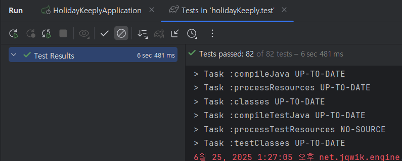

# HolidayKeeply
전 세계 공휴일 데이터를 외부 API로부터 수집, 저장, 조회, 관리하는 미니 서비스

## 🏁 프로젝트 목표

외부 API 2개만 사용하여 <br>
최근 5년(2020~2025) 전 세계 공휴일 데이터를 저장·조회·관리
데이터 적재, 검색(필터/페이징), 재동기화(Upsert), 삭제, (선택)배치 자동화 기능 제공

## 🛠️ 기술 스택
- Java 21
- Spring Boot 3.4
- Spring Data JPA, QueryDSL
- H2 Database (테스트용)
- Gradle
- Swagger (API 문서화)
- JUnit5 (테스트)

## 📦 프로젝트 구조
src/main/java/com/holidaykeeply/ <br>
├── api/ # API 컨트롤러, DTO, 서비스 등 Presentation 계층 <br>
├── domain/ # 엔티티, 레포지토리, 도메인 서비스 등 도메인 계층 <br>
└── global/ # 글로벌 설정, 스케줄러, ApplicationRunner 등 공통 모듈

## 🚀 실행 방법
```
./gradlew build
./gradlew bootRun
```

Swagger API 문서 접속
http://localhost:8080/swagger-ui/index.html

## ✅ Build & Test 성공 확인



## 🏗️ 아키텍처 및 설계 패턴

### 1. 확장 가능한 Provider 패턴
**Strategy Pattern**을 활용한 데이터 소스 확장성 구현:
```java
// CountryProvider 인터페이스
public interface CountryProvider {
    Mono<List<Country>> getCountries();
}

// API 기반 구현체
@Qualifier("countryApiProvider")
@Component
public class CountryApiProvider implements CountryProvider {
    // 외부 API에서 국가 정보 조회
}

// DB 기반 구현체  
@Qualifier("countryDbProvider")
@Component
public class CountryDbProvider implements CountryProvider {
    // 로컬 DB에서 국가 정보 조회
}
```
- **장점**: 새로운 데이터 소스 추가 시 인터페이스만 구현하면 됨
- **활용**: 스케줄러에서 `@Qualifier`로 원하는 Provider 선택 가능

### 2. 커스텀 검증 어노테이션
**AOP 기반 유효성 검증**으로 비즈니스 로직과 검증 로직 분리:
```java
// 커스텀 어노테이션
@ExistsCountryName
@ExistsCountryCode
@ValidDateRange

// 검증기 구현
public class ExistsCountryNameValidator implements ConstraintValidator<ExistsCountryName, String> {
    // DB 조회를 통한 실시간 검증
}
```
- **장점**: 재사용 가능한 검증 로직, 선언적 검증
- **확장성**: 새로운 검증 규칙 추가 시 어노테이션만 정의

### 3. QueryDSL 기반 동적 쿼리
**Builder Pattern**을 활용한 유연한 검색 조건 처리:
```java
public class HolidayCustomRepositoryImpl {
    private BooleanExpression dateBetween(LocalDate startDate, LocalDate endDate) {
        // 동적 조건 생성
        if (startDate != null && endDate != null) {
            return holiday.date.between(startDate, endDate);
        }
        // ...
    }
}
```
- **장점**: 타입 안전한 쿼리 작성, 복잡한 검색 조건 지원
- **확장성**: 새로운 검색 조건 추가 시 메서드만 추가

### 4. 전역 예외 처리
**AOP 기반 통합 예외 처리**로 일관된 에러 응답:
```java
@RestControllerAdvice
public class GlobalExceptionHandler {
    @ExceptionHandler(MethodArgumentNotValidException.class)
    public ResponseEntity<Response<Map<String, String>>> handleValidationException(...)
    
    @ExceptionHandler(NoSuchElementException.class)
    public ResponseEntity<String> handleNoSuchElementException(...)
}
```
- **장점**: 중앙화된 예외 처리, 일관된 에러 응답 형식
- **확장성**: 새로운 예외 타입 추가 시 핸들러만 추가

### 5. 설정 외부화
**ConfigurationProperties**를 활용한 설정 관리:
```java
@ConfigurationProperties(prefix = "nager.api")
public record NagerApiProperties(
    String baseUrl,
    String availableCountriesPath,
    String publicHolidaysPath
) {}
```
- **장점**: 환경별 설정 분리, 타입 안전한 설정 접근
- **확장성**: 새로운 설정 추가 시 record 필드만 추가

### 6. 스케줄러 기반 자동화
**Cron 기반 자동화**로 운영 부담 최소화:
```java
@Scheduled(cron = "0 0 1 2 1 *", zone = "Asia/Seoul")
public void syncHolidayData() {
    // 매년 1월 2일 01:00 KST 자동 동기화
}
```
- **장점**: 수동 개입 없이 데이터 최신성 보장
- **확장성**: 새로운 스케줄 작업 추가 시 메서드만 추가

### 7. 계층별 책임 분리
**Clean Architecture** 원칙 적용:
- **Presentation Layer**: API 컨트롤러, DTO 변환
- **Domain Layer**: 비즈니스 로직, 엔티티 관리
- **Infrastructure Layer**: 외부 시스템 연동, 데이터 접근
- **Global Layer**: 공통 설정, 유틸리티

### 8. 반응형 프로그래밍
**Reactor Mono/Flux** 활용으로 비동기 처리:
```java
public Mono<List<Country>> getCountries() {
    return countryWebClient.fetchCountries();
}
```
- **장점**: 비동기 처리로 성능 향상, 백프레셔 지원
- **확장성**: 스트림 처리, 에러 복구 등 고급 기능 활용 가능

## 📋 REST API 명세

### 기본 정보
- **Base URL**: `/api/v1`
- **Content-Type**: `application/json`
- **Response Format**: 모든 응답은 `Response<T>` 래퍼 객체로 감싸져 있음

### 공통 응답 형식

#### 성공 응답
```json
{
  "success": true,
  "data": { /* 실제 데이터 */ },
  "error": null
}
```

#### 에러 응답
```json
{
  "success": false,
  "data": null,
  "error": {
    "code": "A-001",
    "message": "잘못된 요청입니다."
  }
}
```

### API 엔드포인트

#### 1. 공휴일 목록 조회
- **URL**: `GET /api/v1/holidays`
- **Description**: 검색 조건에 따라 공휴일 목록을 페이징으로 조회

##### 요청 파라미터
| 파라미터 | 타입 | 필수 | 설명 | 예시 |
|---------|------|------|------|------|
| startDate | LocalDate | Y | 시작 날짜 (ISO 형식) | `2024-01-01` |
| endDate | LocalDate | Y | 종료 날짜 (ISO 형식) | `2024-12-31` |
| countryName | String | Y | 국가명 | `Korea` |
| page | Integer | N | 페이지 번호 (기본값: 1) | `1` |
| size | Integer | N | 페이지 크기 (기본값: 3) | `10` |

##### 요청 예시
```
GET /api/v1/holidays?startDate=2024-01-01&endDate=2024-12-31&countryName=Korea&page=1&size=10
```

##### 응답 예시
```json
{
  "success": true,
  "data": {
    "content": [
      {
        "id": 1,
        "localName": "신정",
        "name": "New Year's Day",
        "country": "Korea",
        "fixed": true,
        "global": false,
        "launchYear": "1949",
        "localDate": "2024-01-01"
      }
    ],
    "pageable": {
      "pageNumber": 0,
      "pageSize": 10,
      "sort": {
        "empty": true,
        "sorted": false,
        "unsorted": true
      }
    },
    "totalElements": 1,
    "totalPages": 1,
    "last": true,
    "size": 10,
    "number": 0,
    "sort": {
      "empty": true,
      "sorted": false,
      "unsorted": true
    },
    "numberOfElements": 1,
    "first": true,
    "empty": false
  },
  "error": null
}
```

#### 2. 공휴일 데이터 동기화 (테스트용)
- **URL**: `PUT /api/v1/holidays/upsert`
- **Description**: 지정된 연도와 국가의 공휴일 데이터를 외부 API에서 동기화

##### 요청 파라미터
| 파라미터 | 타입 | 필수 | 설명 | 예시 |
|---------|------|------|------|------|
| countryCode | String | Y | 국가 코드 | `KR` |
| year | LocalDate | Y | 연도 | `2024-01-01` |

##### 요청 예시
```json
{
  "countryCode": "KR",
  "year": "2024-01-01"
}
```

##### 응답 예시
```json
{
  "success": true,
  "data": "KR가 수정되었습니다.",
  "error": null
}
```

#### 3. 공휴일 데이터 삭제
- **URL**: `DELETE /api/v1/holidays/{countryName}`
- **Description**: 지정된 연도와 국가의 공휴일 데이터를 삭제

##### 경로 파라미터
| 파라미터 | 타입 | 필수 | 설명 | 예시 |
|---------|------|------|------|------|
| countryName | String | Y | 국가명 (URL 경로) | `Korea` |

##### 요청 파라미터
| 파라미터 | 타입 | 필수 | 설명 | 예시 |
|---------|------|------|------|------|
| countryName | String | Y | 국가명 | `Korea` |
| year | LocalDate | Y | 연도 | `2024-01-01` |

##### 요청 예시
```
DELETE /api/v1/holidays/Korea?countryName=Korea&year=2024-01-01
```

##### 응답 예시
```json
{
  "success": true,
  "data": "삭제되었습니다.",
  "error": null
}
```

### 에러 코드

| 에러 코드 | HTTP 상태 | 설명 |
|----------|-----------|------|
| A-001 | 400 | 잘못된 요청입니다. |
| A-002 | 503 | 외부 API 호출 중 오류가 발생했습니다. |
| A-003 | 408 | 외부 API 호출 시간이 초과되었습니다. |
| A-004 | 404 | 요청한 데이터를 찾을 수 없습니다. |

### 유효성 검증

#### 공통 검증 규칙
- `startDate`와 `endDate`는 유효한 날짜 범위여야 함
- `countryName`은 데이터베이스에 존재하는 국가명이어야 함
- `countryCode`는 데이터베이스에 존재하는 국가 코드여야 함

#### 날짜 형식
- 모든 날짜는 ISO 형식 (`YYYY-MM-DD`)을 사용
- `year` 파라미터는 연도를 나타내지만 `LocalDate` 타입으로 전달

### 페이징
- 기본 페이지 크기: 3
- 기본 페이지 번호: 1
- 페이지 번호는 1부터 시작
# holidayKeeply
# holidayKeeply
